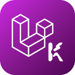

<p align="center">
    
</p>

# Filament Starter Kit

[](https://packagist.org/packages/lyrihkaesa/filament-starter-kit)
[](https://packagist.org/packages/lyrihkaesa/filament-starter-kit)
[](https://php.net)
[](https://laravel.com)
[](LICENSE)

Starter kit modern untuk membangun admin panel tangguh menggunakan **Laravel 12** dan **Filament v5**. 

Fokus utama kit ini adalah **Developer Experience (DX)** dengan struktur yang sangat rapi, *strict typing*, dan pola kode yang *maintainable* untuk project jangka panjang. Cocok untuk developer yang menginginkan standar kualitas tinggi seperti ekosistem TypeScript di dalam Laravel.

## ✨ Highlight Fitur

- **Modern Stack**: Laravel 12, Filament v5, Livewire 4, dan Tailwind CSS v4.
- **Architectural Excellence**: Menggunakan **Action Pattern** (`handle()`) untuk memisahkan business logic dari Controller/Page.
- **Strict Typing**: Codebase yang bersahabat dengan *strict types* untuk keamanan kode yang lebih baik.
- **API Ready**: Integrasi **Laravel Sanctum** yang siap digunakan untuk aplikasi mobile atau frontend terpisah.
- **Security & RBAC**: Manajemen akses canggih menggunakan **Filament Shield**.
- **Privacy Focused**: Sistem **Anonymization** otomatis untuk user yang dihapus (GDPR-friendly).
- **UUID First**: Standar penggunaan UUID untuk tabel baru guna skalabilitas dan keamanan.
- **Quality Assurance**: Terintegrasi penuh dengan **Pest 4**, **Pint**, **Larastan**, dan **Rector**.

## 🚀 Quick Start

### Install via Laravel Installer

```bash
laravel new my-app --using=lyrihkaesa/filament-starter-kit
cd my-app
composer install
npm install
cp .env.example .env
php artisan key:generate
php artisan migrate --seed
npm run build
composer dev
```

### Akun Admin Default

- **Email**: `admin@example.com`
- **Password**: `password`

## 🛠️ Tech Stack & Tools

| Kategori | Teknologi |
| --- | --- |
| **Framework** | Laravel 12, Filament 5, Livewire 4 |
| **Auth** | Sanctum (API), Shield (RBAC) |
| **Styling** | Tailwind CSS 4 |
| **Testing** | Pest 4 |
| **Code Quality** | Pint (Linting), Larastan (Static Analysis), Rector (Refactoring) |
| **Utilities** | Laravel Boost, Matomo Device Detector |

## 📖 Prinsip Pengembangan

1.  **Action Pattern**: Logic bisnis harus berada di kelas Action, bukan di Controller atau Filament Page.
2.  **API Versioning**: Endpoint API terstruktur di bawah `/api/v1` dengan *Eloquent Resources*.
3.  **Soft Deletes & Anonymize**: User yang dihapus akan di-anonymize datanya sebelum benar-benar dihapus permanen.
4.  **No N+1 Queries**: Selalu memprioritaskan *eager loading* untuk performa database.

## 📚 Dokumentasi Lengkap

Dokumentasi detail dapat ditemukan di folder [`docs`](./docs) atau melalui:

👉 **[Dokumentasi Online Filament Starter Kit](https://kaesa.charapon.my.id/filament-starter-kit)**

### Panduan Penting:
- [00 - Intro & Filosofi](./docs/00-intro.md)
- [02 - Menggunakan Action Pattern](./docs/02-action-pattern.md)
- [07 - Integrasi API & Sanctum](./docs/07-api.md)
- [14 - Manajemen Role & Permission](./docs/14-filament-shield.md)
- [18 - Implementasi UUID](./docs/18-uuid-primary-keys.md)
- [26 - Curator Ownership & Privacy](./docs/26-curator-ownership-and-privacy.md)
- [27 - Media Tracking & Integrity](./docs/27-media-usage-tracking.md)

## ✅ Quality Control

Jalankan perintah berikut untuk menjaga kualitas codebase:

- **Semua Tes**: `composer test-full`
- **Unit & Feature Test**: `php artisan test`
- **API Testing**: `bru run api-tests/bruno --env local`
- **Auto Format**: `composer lint`
- **Static Analysis**: `composer test:types`
- **Auto Refactor**: `composer refactor`

## 📄 Lisensi

Proyek ini menggunakan lisensi [MIT](LICENSE).
