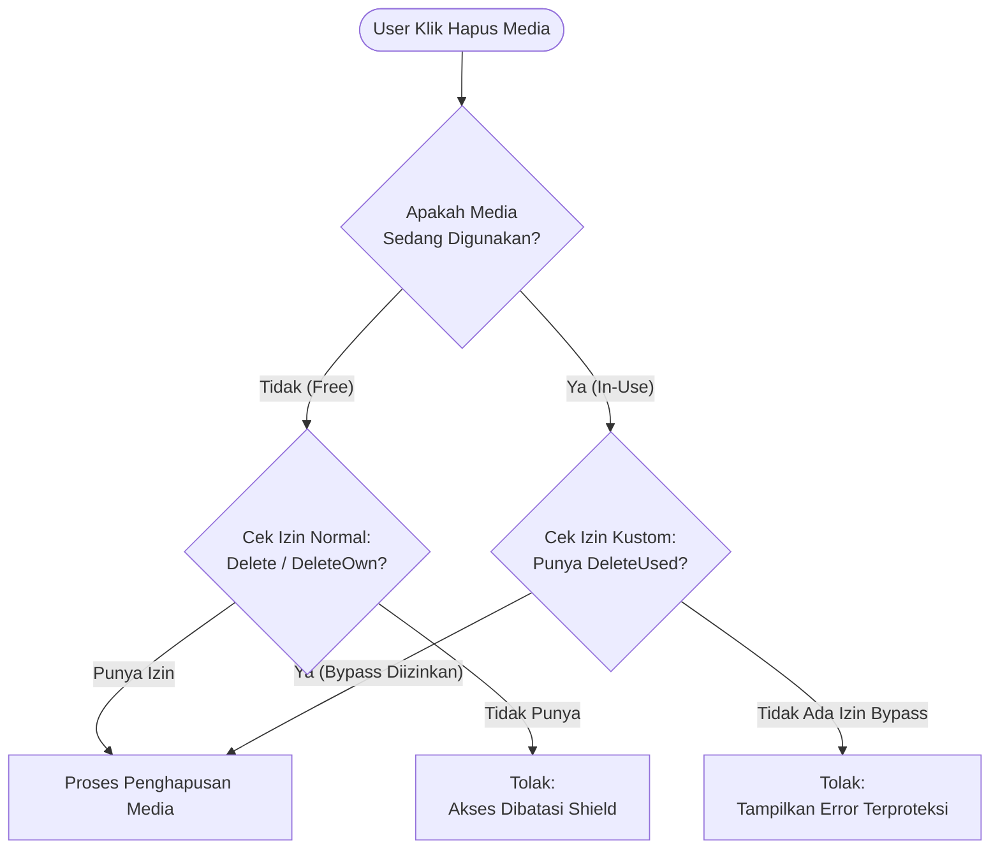

# Media Protection & Usage Tracking System

Sistem ini dirancang untuk memastikan integritas data media (Curator) dan mengamankan konfigurasi sensitif (Roles/Posts) melalui kombinasi *Logic Protection*, *Automatic Tracking*, dan *Hardened Policies*.

## 📌 Fitur Utama

- **Media Deletion Protection**: Media yang sedang digunakan (in-use) tidak bisa dihapus kecuali oleh user dengan permission `DeleteUsed:CuratorMedia`.
- **Automatic Usage Sync**: Sinkronisasi otomatis antara model (post) dan media menggunakan observer.
- **Role/Post Hardening**: Proteksi role super_admin dan pengaturan hak akses post berdasarkan kepemilikan.

## 🔄 Alur Logika Penghapusan

## ⚙️ Penjelasan Konfigurasi (Deep Dive)

Akses konfigurasi berikut telah diubah untuk mendukung sistem ini:

### 1. `config/curator.php`
- **Perubahan**: Mengarahkan `MediaResource` ke `App\Filament\Curator\MediaResource`.
- **Alasan**: Agar Filament menggunakan aksi `Delete` kustom kita, bukan aksi bawaan paket yang tidak punya proteksi "In-Use".

### 2. `config/filament-shield.php`
- **`custom_permissions` => true**: Mengizinkan Shield mendeteksi izin manual kita.
- **Resource Permission Mapping**: Mendaftarkan `viewOwn`, `updateOwn`, dan `deleteUsed` agar muncul sebagai checkbox di halaman **Peran/Roles**.
- **`define_via_gate`**: Menggunakan variabel lingkungan agar fitur otorisasi Shield bisa diuji secara akurat di unit tests.

## 🛠 Detail Teknis Komponen

- **Model Hooks**: Terletak di `App\Models\Post::booted()`. Menjamin sinkronisasi media berjalan di background tanpa perlu *coding* manual di banyak tempat.
- **Custom Actions**: 
  - `CuratorMediaDeleteAction` (Single)
  - `CuratorMediaDeleteBulkAction` (Massal)
- **Edit Page Override**: `App\Filament\Pages\Media\EditMedia` menampilkan peringatan jika tombol hapus dinonaktifkan.

## 📑 Daftar Berkas Terkait
- [30-media-usage-and-protection-system.md](file:///e:/Projects/Laravel/filament-starter-kit/docs/30-media-usage-and-protection-system.md) (Dokumentasi Publik)
- `App\Policies\RolePolicy`: Proteksi role super_admin.
- `App\Policies\PostPolicy`: Otorisasi berbasis kepemilikan author.

---
*Folder ini menggantikan folder lama: curator-media-delete-guard dan media-action-orchestration.*
